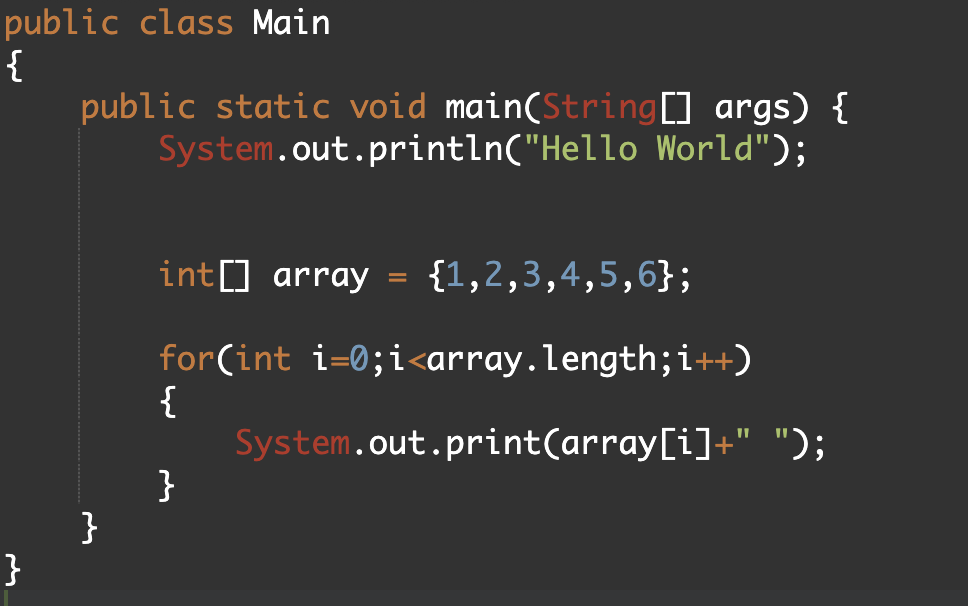

# Hello, this is a read me file  

  

 
 
 
 
 

  

---------------------------------------------------------------------------------------------

# we will discuss about adding contents to the file
