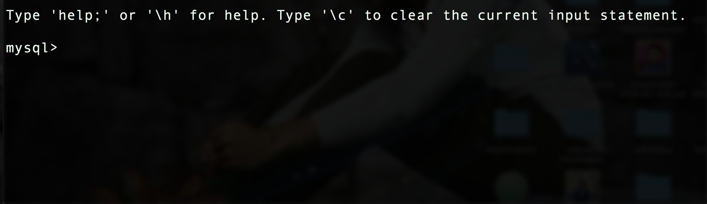

# Hello, this is a read me file </br>

 </br>

---------------------------------------------------------------------------------------------


# we will discuss about adding contents to the file
</br>

```
public class A {
    public static void main(String args[]){
        for(int i=0; i<10; i++){
            System.out.println("Hello, this is a test program!!");
        }
    }
}
```


</br>


---------------------------------------------------------------------------------------------
